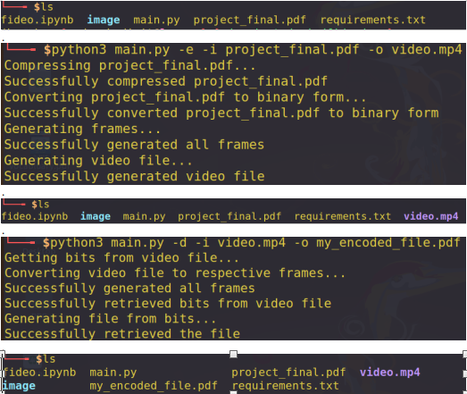

[![Contributors][contributors-shield]][contributors-url]
[![Forks][forks-shield]][forks-url]
[![Stargazers][stars-shield]][stars-url]
[![Issues][issues-shield]][issues-url]
[![MIT License][license-shield]][license-url]


<!-- PROJECT LOGO -->
<br />
<p align="center">

  <h3 align="center">Fideo</h3>

  <p align="center">
    Encodes any file to a video
    <br />
    <br />
    <a href="https://github.com/shie-ld/fideo/issues">Report Bug</a>
    ·
    <a href="https://github.com/shie-ld/fideo/issues">Request Feature</a>
  </p>
</p>


<!-- TABLE OF CONTENTS -->
## Table of Contents

* [About the Project](#about-the-project)
  * [Built With](#built-with)
* [Getting Started](#getting-started)
  * [Prerequisites](#prerequisites)
  * [Installation](#installation)
* [Usage](#usage)
* [Contributing](#contributing)
* [License](#license)
* [Contact](#contact)


<!-- ABOUT THE PROJECT -->
## About The Project



Hey fellos, have you ever wondered that in this age of cloud, where you want to fetch anything at anytime from anywhere from your personal cloud storage, you can do it for free, as of now, without bothering to spend a single penny from your pocket. 

This project is aimed at:
* Encoding any file - pdf, image, zip archive, anything to a video
* Uploading that video to YouTube, as it provides us free umlimited cloud storage of videos
* Downloading that video anywhere and decoding back it into our original file

So in short, we are going to exploit the unlimited free cloud storage of videos provided by YouTube as our cloud backup of files. 

This is gonna be an short and interesting project with documentation at every step to help you in understanding what program does, and if you wish, you can change it as you want so it does computing what you wish, not what is decided by me.

### Built With

* [Python3](https://www.python.org/)
* [Jupyter notebook](https://jupyter.org/)


<!-- GETTING STARTED -->
## Getting Started

Grab a python3 distribution and run the source code with the help of jupyter notebook. Both of these get set up if you install anaconda distribution on your system.

Or you can just have python3 installed on your machine and run `main.py` with proper options and arguments right from your terminal.

### Prerequisites

* bitstring
* Pillow
* glob2
* path.py
* ffmpeg-python

After installing anaconda, run in the `src` directory : 
```sh
pip install -r requirements.txt
```
in your terminal to install all the required dependencies and modules. Else they get installed automatically if you run the ipython notebook.

### Installation

1. Clone the repo
```sh
git clone https://github.com/shie-ld/fideo.git
```
2. Install required modules
```sh
pip install -r requirements.txt
```
3. Run the ipython notebook in `src` folder 

Don't forget to put in the filename you want to encode in `encode_file` function in the last of the notebook. Check current directory and viola, you have encoded the file to video.

<p align="center">
                                            **OR** 
 </p>
                                             
4. Hit `python3 main.py [options] <arguments>` with [proper options and arguments](#usage) and you are good to go.


<!-- USAGE EXAMPLES -->
## Usage
### Using Jupyter Notebook:
Encode `file.zip` to `OUTFILE.mp4`: 
```sh
encode_file('file.zip')
```
Decode `OUTFILE.mp4` to `OUT.zip`:
```sh
decode_file('OUTFILE.mp4', 'OUT.zip')
```
which should come out to be an exact copy of `file.zip`. You can verify that by comparing the two files.


### Using Command Line:
```sh
OPTIONS
-e | --encode : Specify you want to encode a file

-d | --decode : Specify you want to decode a file

-i | --input : Specifying the input file. You can use absolute paths as well as relative paths. 
               It is a required argument.
               eg. -i /home/user/file.zip
               
-o | --output : Specifying the output file. You can use absolute paths as well as relative paths.
                Any existing file with same name will be deleted.
                At encoding time default is OUTFILE.mp4
                eg. -o /home/user/video.mp4
                
-f | --framerate : Specify the encoding and decoding framerate of video. Default is 24.
                   Must be integer. Encoding and Decoding should have the same framerate.
                
```

So practical usage will look like: 
```sh
pip install -r requirements.txt

# encoding
python3 main.py -e -i infile.zip -f 15 -o video.mp4 

# decoding
python3 main.py -d -i video.mp4 -f 15 -o outfile.mp4 

```

### NOTE:

Due to some issues, you may see a warning when you access the program through command line. Anyways, you can ignore the warnings and the program will run fine.


```sh
/bin/bash: warning: setlocale: LC_ALL: cannot change locale (en_US.UTF-8)
ffmpeg version n4.3.1 Copyright (c) 2000-2020 the FFmpeg developers
  built with gcc 7 (Ubuntu 7.5.0-3ubuntu1~18.04)
  configuration: --prefix= --prefix=/usr --disable-debug --disable-doc --disable-static --enable-cuda --enable-cuda-sdk --enable-cuvid --enable-libdrm --enable-ffplay --enable-gnutls --enable-gpl --enable-libass --enable-libfdk-aac --enable-libfontconfig --enable-libfreetype --enable-libmp3lame --enable-libnpp --enable-libopencore_amrnb --enable-libopencore_amrwb --enable-libopus --enable-libpulse --enable-sdl2 --enable-libspeex --enable-libtheora --enable-libtwolame --enable-libv4l2 --enable-libvorbis --enable-libvpx --enable-libx264 --enable-libx265 --enable-libxcb --enable-libxvid --enable-nonfree --enable-nvenc --enable-omx --enable-openal --enable-opencl --enable-runtime-cpudetect --enable-shared --enable-vaapi --enable-vdpau --enable-version3 --enable-xlib
  libavutil      56. 51.100 / 56. 51.100
  libavcodec     58. 91.100 / 58. 91.100
  libavformat    58. 45.100 / 58. 45.100
  libavdevice    58. 10.100 / 58. 10.100
  libavfilter     7. 85.100 /  7. 85.100
  libswscale      5.  7.100 /  5.  7.100
  libswresample   3.  7.100 /  3.  7.100
  libpostproc    55.  7.100 / 55.  7.100
Input #0, image2, from './inframes/frame_%d.png':
  Duration: 00:00:00.08, start: 0.000000, bitrate: N/A
    Stream #0:0: Video: png, monob(pc), 854x480, 25 tbr, 25 tbn, 25 tbc

```
<p align="center">
  **OR**
 </p>

```sh
bin/bash: warning: setlocale: LC_ALL: cannot change locale (en_US.UTF-8)
ffmpeg version n4.3.1 Copyright (c) 2000-2020 the FFmpeg developers
  built with gcc 7 (Ubuntu 7.5.0-3ubuntu1~18.04)
  configuration: --prefix= --prefix=/usr --disable-debug --disable-doc --disable-static --enable-cuda --enable-cuda-sdk --enable-cuvid --enable-libdrm --enable-ffplay --enable-gnutls --enable-gpl --enable-libass --enable-libfdk-aac --enable-libfontconfig --enable-libfreetype --enable-libmp3lame --enable-libnpp --enable-libopencore_amrnb --enable-libopencore_amrwb --enable-libopus --enable-libpulse --enable-sdl2 --enable-libspeex --enable-libtheora --enable-libtwolame --enable-libv4l2 --enable-libvorbis --enable-libvpx --enable-libx264 --enable-libx265 --enable-libxcb --enable-libxvid --enable-nonfree --enable-nvenc --enable-omx --enable-openal --enable-opencl --enable-runtime-cpudetect --enable-shared --enable-vaapi --enable-vdpau --enable-version3 --enable-xlib
  libavutil      56. 51.100 / 56. 51.100
  libavcodec     58. 91.100 / 58. 91.100
  libavformat    58. 45.100 / 58. 45.100
  libavdevice    58. 10.100 / 58. 10.100
  libavfilter     7. 85.100 /  7. 85.100
  libswscale      5.  7.100 /  5.  7.100
  libswresample   3.  7.100 /  3.  7.100
  libpostproc    55.  7.100 / 55.  7.100
Input #0, mov,mp4,m4a,3gp,3g2,mj2, from 'video.mp4':
  Metadata:
    major_brand     : isom
    minor_version   : 512
    compatible_brands: isomiso2avc1mp41
    encoder         : Lavf58.45.100
  Duration: 00:00:00.08, start: 0.000000, bitrate: 29530 kb/s
    Stream #0:0(und): Video: h264 (High 4:4:4 Predictive) (avc1 / 0x31637661), yuvj444p(pc), 854x480, 29687 kb/s, 24 fps, 24 tbr, 12288 tbn, 48 tbc (default)
    Metadata:
      handler_name    : VideoHandler
Stream mapping:
  Stream #0:0 (h264) -> fps
  fps -> Stream #0:0 (png)
Press [q] to stop, [?] for help
[swscaler @ 0x56482c82f3c0] deprecated pixel format used, make sure you did set range correctly
Output #0, image2, to './outframes/frame_%d.png':
  Metadata:
    major_brand     : isom
    minor_version   : 512
    compatible_brands: isomiso2avc1mp41
    encoder         : Lavf58.45.100
    Stream #0:0: Video: png, rgb24, 854x480, q=2-31, 200 kb/s, 24 fps, 24 tbn, 24 tbc (default)
    Metadata:
      encoder         : Lavc58.91.100 png
frame=    2 fps=0.0 q=-0.0 Lsize=N/A time=00:00:00.08 bitrate=N/A speed=0.505x    
video:513kB audio:0kB subtitle:0kB other streams:0kB global headers:0kB muxing overhead: unknown

```


<!-- ROADMAP -->
## Roadmap

See the [open issues](https://github.com/issues) for a list of proposed features (and known issues).


<!-- CONTRIBUTING -->
## Contributing

Contributions are what make the open source community such an amazing place to be learn, inspire, and create. Any contributions you make are **greatly appreciated**.

1. Fork the Project
2. Create your Feature Branch (`git checkout -b feature/AmazingFeature`)
3. Commit your Changes (`git commit -m 'Add some AmazingFeature'`)
4. Push to the Branch (`git push origin feature/AmazingFeature`)
5. Open a Pull Request


<!-- LICENSE -->
## License

Distributed under the MIT License. See `LICENSE` for more information.


<!-- CONTACT -->
## Contact

Rudresh Dixit -> 00rudreshdixit@gmail.com

Nitin Yadav -> nitinyadav3299@gmail.com

Felix Toppo -> rtoppo99@gmail.com


Project Link: [https://github.com/shie-ld/fideo](https://github.com/shie-ld/fideo)


<!-- MARKDOWN LINKS & IMAGES -->
[contributors-shield]: https://img.shields.io/github/contributors/shie-ld/fideo.svg?style=flat-square
[contributors-url]: https://github.com/shie-ld/fideo/graphs/contributors
[forks-shield]: https://img.shields.io/github/forks/shie-ld/fideo.svg?style=flat-square
[forks-url]: https://github.com/shie-ld/fideo/network/members
[stars-shield]: https://img.shields.io/github/stars/shie-ld/fideo.svg?style=flat-square
[stars-url]: https://github.com/shie-ld/fideo/stargazers
[issues-shield]: https://img.shields.io/github/issues/shie-ld/fideo.svg?style=flat-square
[issues-url]: https://github.com/shie-ld/fideo/issues
[license-shield]: https://img.shields.io/github/license/shie-ld/fideo.svg?style=flat-square
[license-url]: https://github.com/shie-ld/textwritten/blob/main/LICENSE


